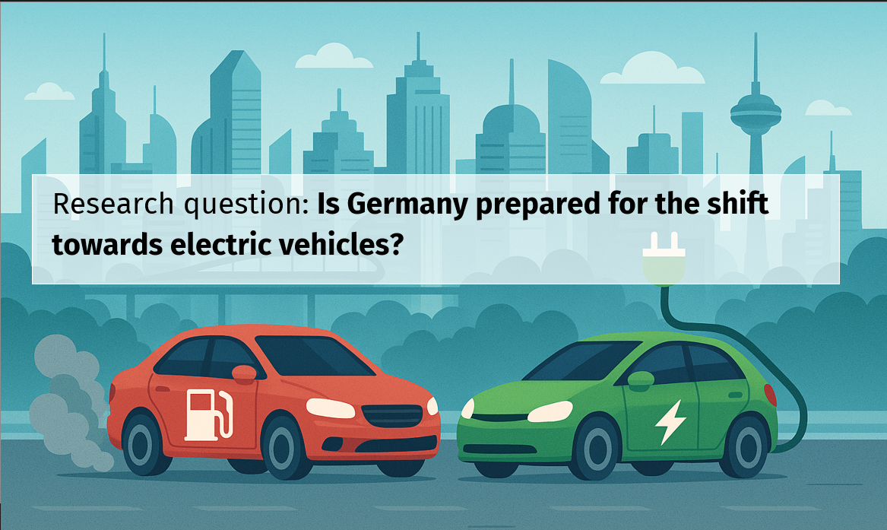

# Analysis of Charging Infrastructure in Germany

To reduce CO₂ emissions, the European Union has enacted a law banning the sale of new petrol and diesel cars starting in [2035](https://www.europarl.europa.eu/topics/en/article/20221019STO44572/eu-ban-on-sale-of-new-petrol-and-diesel-cars-from-2035-explained). This transition will significantly increase the demand for electric vehicles (EVs) and, consequently, for charging infrastructure.

## Question
The key question is: Is Germany prepared for this shift? Does the country have the necessary charging infrastructure to support the growing number of electric vehicles, or are there critical gaps that need to be addressed?

## Datasets

- `Car registrations in Germany`:
https://www.kba.de/DE/Statistik/Produktkatalog/produkte/Fahrzeuge/fz27_b_uebersicht.html?nn=4543062

- `Charging stations in Germany`:
https://www.bundesnetzagentur.de/DE/Fachthemen/ElektrizitaetundGas/E-Mobilitaet/Ladesaeulenkarte/start.html

- `Gas Stations`: 
https://www.bft.de/daten-und-fakten/entwicklung-tankstellenanzahl

- `Population`:
https://www.statistikportal.de/de/bevoelkerung/flaeche-und-bevoelkerung

## Authors and acknowledgment

This analysis has been performed by:

- [Adeline Silva Schäfer](https://github.com/adelinerd)

with cntributions from [AllWomen](https://www.allwomen.tech/bootcamp/data-analytics-bootcamp/) instructors:

- Asia Noble
- Sofía Valcarel

## Getting started
Check `TechnicalDocumentation.md` for documentation on what to install, folder structure, etc.

## License

MIT License

Copyright (c) 2025 Adeline Silva Schäfer

Permission is hereby granted, free of charge, to any person obtaining a copy
of this software and associated documentation files (the "Software"), to deal
in the Software without restriction, including without limitation the rights
to use, copy, modify, merge, publish, distribute, sublicense, and/or sell
copies of the Software, and to permit persons to whom the Software is
furnished to do so, subject to the following conditions:

The above copyright notice and this permission notice shall be included in all
copies or substantial portions of the Software.

THE SOFTWARE IS PROVIDED "AS IS", WITHOUT WARRANTY OF ANY KIND, EXPRESS OR
IMPLIED, INCLUDING BUT NOT LIMITED TO THE WARRANTIES OF MERCHANTABILITY,
FITNESS FOR A PARTICULAR PURPOSE AND NONINFRINGEMENT. IN NO EVENT SHALL THE
AUTHORS OR COPYRIGHT HOLDERS BE LIABLE FOR ANY CLAIM, DAMAGES OR OTHER
LIABILITY, WHETHER IN AN ACTION OF CONTRACT, TORT OR OTHERWISE, ARISING FROM,
OUT OF OR IN CONNECTION WITH THE SOFTWARE OR THE USE OR OTHER DEALINGS IN THE
SOFTWARE.
